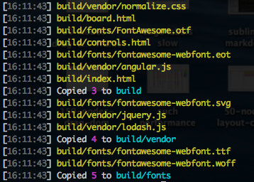

# gulp-count [](https://www.npmjs.com/package/gulp-count) [](https://circleci.com/gh/palantir/gulp-count)

> Count files in vinyl streams. Log pretty messages.



This plugin solves a similar problem to [gulp-debug](https://github.com/sindresorhus/gulp-debug) but is designed as an actual permanent part of your workflow, not just a debug tool (though it still makes a great debug tool!). As such, it provides more control over logging to customize as needed.

## Usage
First, install `gulp-count` as a development dependency:

```shell
> npm install --save-dev gulp-count
```

Then, add it to your `gulpfile.js`:

```javascript
var count = require('gulp-count');

gulp.task('copy', function() {
    gulp.src('assets/**.*')
        .pipe(gulp.dest('build'))
        .pipe(count('## assets copied'));
});
```


## API
gulp-count can be called with a string message template, an options object, or both.

```javascript
gulp.src('*.html')
    .pipe(count()) // logs "36 files"
    .pipe(count('<%= counter %> HTML files'))  // logs "36 HTML files"
    .pipe(count('found ## pages', {logFiles: true})) // logs each path and "found 36 pages"
    .pipe(count({
        message: '<%= files %>? That\'s ## too many!'
        logger: (msg) -> alert(msg) // alerts "36 files? That's 36 too many!"
    });
```

### `count(options?)`
### `count(message, options?)`

##### `options.message: boolean | string = "<%= files %>"`

Template string for total count message, passed through [`gutil.template`](https://github.com/gulpjs/gulp-util#templatestring-data).

Template can use two variables:

1. `counter` - the number of files encountered in this stream,
2. `files` - a correctly pluralized string of the format "X file[s]" where X is `counter`.

The template also expands the shorthand `"##"` to `"<%= counter %>"`.

An explicit `false` value will disable the message (use `logFiles` or `logEmpty` instead).

##### `options.logFiles: boolean | string = false`

Whether to log each file path as it is encountered. `options.cwd` determines base path for logging.

If a string is provided then it is used as the message template. Template receives two variables:

1. `file` - the current Vinyl file instance
2. `path` - file path resolved relative to `options.cwd` and colored yellow.

##### `options.logEmpty: boolean | string = false`

Whether to log the message when the stream is empty.

If a string is provided then it is used as the message template and receives the same variables as `options.message`.

Setting `{ message: false, logEmpty: true }` will log _if and only if_ the stream is empty.

##### `options.title: string`

String prepended to every message to distinguish the output of multiple instances logging at once.
A falsy value will print nothing.

##### `options.cwd: string = ""`

Current working directory against which file paths are resolved in template strings.

##### `options.logger: (message) => any = gutil.log`

Logger function, called with each formatted message. Defaults to gulp-util's [`log(msg...)`](https://github.com/gulpjs/gulp-util#logmsg) function.


## License
MIT &copy; [Palantir Technologies](http://palantir.com)
